<!-- ═══════════════════════════════════════════════ HEADER ══ -->

  

 

> 📡 Badges above are shields.io (queries the GitHub API live, no reliability issues). The **Stats, Top Languages, Streak, Trophies, Snake, and Featured Projects** graphics below are pre-rendered by GitHub Actions into `/profile/*.svg` and served straight from this repo — they don't depend on the public `vercel.app` demo endpoints, which have been going down / rate-limiting site-wide.

  
  

---

<!-- ═══════════════════════════════════════════════ ABOUT ME ══ -->

## 🙋‍♂️ About Me

<table>
<tr>
<td valign="top" width="55%">

### Hi, I'm **Emmanuel Kiptoo** 👨‍💻

I'm a passionate **Full Stack Developer** based in **Nairobi, Kenya 🇰🇪**, building modern, scalable web applications that solve real-world problems.

I love working across the entire stack — from crafting sleek Angular/React frontends to architecting robust Spring Boot and Node.js backends, backed by PostgreSQL databases. I care as much about *how* a system is put together as what it does on screen — most of my "coding time" is actually spent thinking before I touch a keyboard (see [🧩 How I Design & Build](#-how-i-design--build) below).

 

🔭 &nbsp;Currently building a **Vehicle Management System** (Spring Boot + Angular) 
🌱 &nbsp;Learning **Microservices**, **Docker**, **CI/CD** & **Cloud Deployment** 
💬 &nbsp;Ask me about **Angular, React, Spring Boot, Node.js, TypeScript, System Design** 
🤝 &nbsp;Open to **collaborations**, **freelance work**, and **open-source** 
🏆 &nbsp;GitHub Achievement: **Pull Shark** 🦈 
⚡ &nbsp;Fun fact: I debug with `console.log` — no shame! 😄 
📍 &nbsp;**Nairobi, Kenya** &nbsp;|&nbsp; 📧 **kkgg7241@gmail.com**

 

</td>
<td valign="top" width="45%" align="center">

  

| 📋 | Info |
|---|---|
| 💼 | Full Stack Developer |
| 🌍 | Nairobi, Kenya |
| ✉️ | kkgg7241@gmail.com |
| ⏰ | UTC+3 Timezone |
| 🧱 | Spring Boot · Angular · React · Node.js |

</td>
</tr>
</table>

---

<!-- ══════════════════════════════════════════════ CONNECT ══ -->

## 🌐 Connect With Me

---

<!-- ══════════════════════════════════════════════ TECH STACK ══ -->

## 🛠️ Tech Stack & Tools

### 🗣️ Programming Languages

### 🎨 Frontend Development

### ⚙️ Backend Development

### 🗄️ Databases

### 🔧 Tools, DevOps & Cloud

---

<!-- ══════════════════════════════════════════════ SKILLS TABLE ══ -->

## 🧠 Skills Overview

| Skill | Level | Progress |
|---|:---:|---|
| 🎨 Frontend (Angular / React) | Expert | `████████████████████` 90% |
| ⚙️ Backend (Spring Boot / Node) | Advanced | `███████████████████░` 85% |
| 🗄️ Database Design | Advanced | `██████████████████░░` 80% |
| 🔌 REST API Development | Expert | `████████████████████` 90% |
| 🔐 JWT & Auth Systems | Advanced | `███████████████████░` 85% |
| 🐙 Git & Version Control | Expert | `████████████████████` 90% |
| 🐳 Docker & DevOps | Intermediate | `████████████░░░░░░░░` 55% |
| 📐 System Design | Intermediate | `██████████████░░░░░░` 65% |
| ☁️ Cloud (AWS / GCP) | Beginner | `█████████░░░░░░░░░░░` 40% |

---

<!-- ══════════════════════════════════════════════ SYSTEM DESIGN & WORKFLOW ══ -->

## 🧩 How I Design & Build

I treat every project as a small system, not a pile of files. Roughly, this is the loop I follow, whether it's a weekend project or something like the Vehicle Management System:

### 1. Understand the problem before the stack
- Write down the **actors** (who uses this — admin, driver, customer?) and the **core flows** (what does each actor actually need to *do*?).
- Sketch the domain model on paper first — entities, relationships, and which side "owns" a piece of data — before opening an IDE.
- Decide what's actually in scope for v1 vs. what's a "later" feature. Most bugs I've shipped came from skipping this step.

### 2. Architecture sketch
- **Layering:** Controller → Service → Repository on the backend (Spring Boot), with DTOs at the boundary so the API contract doesn't leak persistence details.
- **Frontend:** feature-based module structure (Angular) or feature folders (React) — components stay dumb, state and API calls live in dedicated services/hooks.
- **Data:** model the PostgreSQL schema with normalization first, then deliberately denormalize only where a read pattern demands it.
- **Contracts first:** define the REST endpoints (resource, verb, status codes, payload shape) before writing implementation, so frontend and backend can move in parallel.

### 3. Non-functional concerns, early
- **Auth:** JWT-based stateless auth, role-based access at the endpoint level, refresh-token rotation for longer sessions.
- **Scalability:** favor stateless services so horizontal scaling is just "add another instance"; push hot reads behind Redis caching where it matters.
- **Resilience:** validate at the boundary (DTO validation), fail fast with meaningful HTTP status codes, centralized exception handling instead of scattered try/catch.
- **Observability:** structured logging from day one — it's much cheaper to add before a bug shows up than after.

### 4. Build in vertical slices
- Ship one full flow end-to-end (DB → API → UI) before broadening to the next feature, rather than building every layer fully before connecting them.
- This surfaces integration issues (CORS, serialization mismatches, auth edge cases) early, when they're cheap to fix.

### 5. Iterate with tests and Docker
- Unit tests around business logic (JUnit 5 on the backend, Jest on the frontend), integration tests around the riskiest flows.
- Containerize early with Docker so "works on my machine" stops being a category of bug, and the eventual CI/CD pipeline has less to bolt on later.

### 6. Ship, measure, refactor
- Small, reviewable commits with clear messages over big-bang merges.
- Once something is live, real usage tells me more than my assumptions did — that feedback loop is what decides the next iteration, not just a roadmap written in week one.

| Phase | Primary Question | Tools I Lean On |
|---|---|---|
| 🧭 Discovery | Who uses this, and for what? | Notes, whiteboard sketches, domain modeling |
| 🏗️ Architecture | How do the pieces talk to each other? | ER diagrams, API contracts, sequence sketches |
| 🔐 Non-functional | What breaks this at scale or under bad input? | Auth design, validation, caching, logging |
| ⚒️ Build | Smallest end-to-end slice I can ship? | Spring Boot, Angular/React, Docker |
| ✅ Verify | Does it actually do what I designed? | JUnit 5, Jest, Postman, manual QA |
| 🔁 Refine | What does real usage tell me? | Metrics, logs, user feedback, refactors |

---

<!-- ══════════════════════════════════════════════ GITHUB STATS (FIXED) ══ -->

## 📊 GitHub Stats

> Self-hosted via GitHub Actions — see `.github/workflows/update-cards.yml`. Regenerated daily and on every push, so it never shows the "broken image" state the public Vercel demo has been throwing.

  
  

 

  

---

## 📈 Contribution Graph

  

---

## 🏆 GitHub Trophies

  

---

<!-- ══════════════════════════════════════════════ PROJECTS ══ -->

## 🚀 Featured Projects — Ranked by Commit Activity

> **Nothing below is hardcoded.** A GitHub Action (`.github/workflows/rank-projects.yml`) runs daily, counts commits you've pushed to each repo in the last 90 days via the GitHub API, ranks them highest → lowest, and rewrites the section between the markers below with the top 5. Push more to a project and it rises here automatically; stop touching it and it drops off. See `scripts/rank-projects.mjs` for the ranking logic.

<!-- PROJECTS:START -->
<!-- This block is regenerated automatically - do not edit by hand, your edits will be overwritten on the next run. -->

> Ranked by commits pushed in the last 90 days - regenerated 2026-08-19

### #1 - KiptooMannu

Config files for my GitHub profile.

-86-6E40C9?style=flat-square) 
 
---

### #2 - Client-Search-Backend

No description set on this repo yet.

-68-6E40C9?style=flat-square) 
---

### #3 - Client-Worker-Connection-Platform

A full-stack freelance marketplace connecting clients with skilled workers through secure hiring, escrow payments, real-time messaging, worker verification, dispute resolution, and review management.

-60-6E40C9?style=flat-square) 
---

### #4 - Enterprise-Authentication-Authorization-System

A production-ready authentication system built with Spring Boot and Angular implementing JWT Authentication, OAuth2 Login, Refresh Tokens, Password Hashing, Role-Based Access Control (RBAC), Secure REST APIs, and modern enterprise security practices.

-28-6E40C9?style=flat-square) 
---

### #5 - Biashara

No description set on this repo yet.

-19-6E40C9?style=flat-square) 

<!-- PROJECTS:END -->

---

<!-- ══════════════════════════════════════════════ LEARNING ══ -->

## 📚 Currently Learning

| 🎯 Area | 📖 Topics | ⏳ Status |
|:---:|---|:---:|
| ☁️ Cloud & DevOps | Docker, CI/CD Pipelines, GitHub Actions, AWS | 🔄 In Progress |
| 🏗️ Architecture | Microservices, Event-Driven Design, DDD | 🔄 In Progress |
| 🔐 Security | Spring Security, OAuth2, API Hardening | 🔄 In Progress |
| 📐 System Design | Scalability, Load Balancing, Caching | 📖 Studying |
| 🧪 Testing | TDD, Jest, JUnit 5, Integration Tests | 📖 Studying |
| 📱 Mobile | React Native basics | 🔜 Upcoming |

---

<!-- ══════════════════════════════════════════════ FUN FACTS ══ -->

## ⚡ Fun Facts About Me

🌍 &nbsp; Based in **Nairobi, Kenya** — East Africa's Silicon Savannah

☕ &nbsp; Best code is written after a cup of **chai tea**

🎧 &nbsp; **Lo-fi music** is my coding superpower

🐛 &nbsp; I name my bugs **"features"** until they're fixed

🌱 &nbsp; Started with **vanilla JS**, never stopped learning

🔥 &nbsp; Consistent GitHub commits = my **daily workout**

😄 &nbsp; `console.log("still debugging...")` — my most used line

---

<!-- ══════════════════════════════════════════════ PHILOSOPHY ══ -->

## 💡 Dev Philosophy

> 💬 *"First, solve the problem. Then, write the code."* — **John Johnson**

> 💬 *"Clean code always looks like it was written by someone who cares."* — **Robert C. Martin**

> 💬 *"Any fool can write code a computer understands. Good programmers write code humans understand."* — **Martin Fowler**

I believe great software lives at the intersection of **technical depth** and **empathy for the user**. Whether I'm designing a REST API, architecting a PostgreSQL schema, or crafting a pixel-perfect Angular UI — I aim to write code that is **readable**, **maintainable**, and **built to last**. Design comes before code, contracts come before implementation, and a small working slice beats a large half-finished one.

---

<!-- ══════════════════════════════════════════════ CONTACT ══ -->

## 📫 Let's Work Together

I'm always open to **interesting projects**, **freelance gigs**, **open-source collabs**, or simply a great tech conversation.

 

 

📍 **Nairobi, Kenya 🇰🇪** &nbsp;|&nbsp; ⏰ **UTC+3** &nbsp;|&nbsp; 💼 **Open to Opportunities**

---

<!-- ══════════════════════════════════════════════ FOOTER ══ -->

  

  ⭐ Star a repo if you find my work useful — it really motivates me to keep building! 🙏 
  Made with ❤️ from Nairobi, Kenya 🇰🇪

